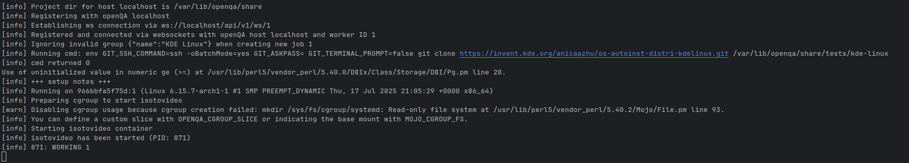

## os-autoinst-distri-kdelinux
> End-to-end tests for KDE Linux using [openQA](https://open.qa/).

### Test Coverage

| Feature Category | Test Case | Status |
|------------------|-----------|--------|
| [Ensure upgrading works](https://invent.kde.org/kde-linux/kde-linux/-/work_items/206) | Discover update page | ✅ |
| [Ensure basic desktop functionality works](https://invent.kde.org/kde-linux/kde-linux/-/work_items/178) | Create a text file on desktop | ✅ |
|  | Open system tray popup | ✅ |
|  | Open Digital Clock popup | ✅ |
|  | Switch windows using Task Manager | ✅ |
| [Ensure automatic login works](https://invent.kde.org/kde-linux/kde-linux/-/work_items/176) | Configure automatic login via System Settings | ✅ |
| [Ensure manual login works](https://invent.kde.org/kde-linux/kde-linux/-/work_items/175) | SDDM login | ✅ |
|  | TTY login / reboot / shutdown | ✅ |
| [Ensure bootability](https://invent.kde.org/kde-linux/kde-linux/-/work_items/174) | UEFI boot menu | ✅ |
|  | Plymouth boot splash | ✅ |
|  | Desktop panel loads | ✅ |
| | UEFI boot menu shows multiple system versions after upgrade | ✅ |


### Bootstrap and start running existing tests on your host

* Start the openQA environment (Terminal 1)
  ```bash
  git clone https://invent.kde.org/anicaazhu/os-autoinst-distri-kdelinux.git
  cd os-autoinst-distri-kdelinux
  podman run --rm -it \
      -v "$PWD":/builds/1/project \
      -w /builds/1/project \
      -p 5991:5991 -p 1443:443 -p 5990:5990 -p 1080:80 -p 9526:9526 \
      --device /dev/kvm  \
      --name openqa-server \
      registry.opensuse.org/devel/openqa/containers/openqa-single-instance
  ```

* When you see the openQA worker is ready,

  Launch Another terminal and run codes below to trigger the test job.
  ```bash
  podman exec -it openqa-server bash
  ```
  ```bash
  ./utils/mocks/job_live+fullsystem/mock.sh --CASEDIR=https://invent.kde.org/anicaazhu/os-autoinst-distri-kdelinux.git
  ```


### Test Case Architecture


### Integrate with Gitlab CI

Currently, we offer two options for running CI jobs:

1. **An openQA instance** – an all-in-one, openSUSE-based image that includes the Web UI, a PostgreSQL database for storing test/job results and authentication/authorization data, the `openqa-worker` service, nginx, etc,.
2. **A lightweight backend-only image** – Also an openSUSE-based image, but contains only the test execution engine (`isotovideo`).
