# os-autoinst-distri-kdelinux
> This repository contains the OpenQA test-related resources for KDE Linux


## Setup for OpenQA WebUI

> OpenQA WebUI is perfect for creating needles, verifying the written OpenQA test scripts, and visually debugging the existing system.
>
> On the other hand, the isotovideo command provided by OpenQA is a headless test script runner that is suitable for minimal CI/CD execution.
>
> We will talk about WebUI first.

## 1. How to replicate my setup?

* Download podman

  ```bash
  yay -S --noconfirm podman
  ```


* Make a host dir to store the built KDE image, and the virtual disk that the system will be installed on.

  ```
  sudo mkdir -p /srv/kde-raw
  sudo rm -rf /srv/kde-raw/install.qcow2
  # sudo qemu-img create -f qcow2 /srv/kde-raw/install.qcow2 50G
  mv <path to your-built-kde.raw file> /srv/kde-raw
  # sudo chown $(whoami):$(whoami) /srv/kde-raw/*
  # sudo chmod 777 /srv/kde-raw/*
  ```
  
  


* Move the pre-built or downloaded `kde_linux*.raw` file to `/srv/kde-raw`, rename it as `kde.raw`


* View OpenQA WebUI at http://localhost:1080/

  ```bash
  podman run -it --rm --device /dev/kvm  --name openqa-server -p 5991:5991 -p 1443:443   -p 1080:80 -p 9526:9526  -v /srv/kde-raw:/var/lib/openqa/factory/hdd:Z  registry.opensuse.org/devel/openqa/containers/openqa-single-instance
  ```
  
  
  
* Enter the container

  ```bash
  sudo podman exec -it openqa-server bash
  ```


* Verify the pre-created disk image, which will serve as the target disk for system installation, is mapped into the podman container.

  ```bash
  cd /var/lib/openqa/factory/hdd
  chmod 777 /var/lib/openqa/factory/hdd/*
  qemu-img create -f qcow2 /var/lib/openqa/factory/hdd/install.qcow2 50G
  ```


* Install python-binding for Perl

  ```shell
  zypper install perl-Inline-Python
  ```

  

* Run the`boot_to_desktop` test

  ```bash
  openqa-cli api -X POST jobs --host http://localhost:9526 DISTRI=kdelinux VERSION=20241107 FLAVOR=live ARCH=x86_64 TEST=boot_to_desktop MACHINE=64bit_kdeos HDD_1=kde.raw PUBLISH_HDD_1=install.qcow2 BOOTFROM=disk BACKEND=qemu UEFI=1 UEFI_PFLASH_CODE=/usr/share/qemu/ovmf-x86_64-4m-code.bin UEFI_PFLASH_VARS=/usr/share/qemu/ovmf-x86_64-4m-vars.bin DO_INSTALL=1 QEMUCPUS=4 QEMURAM=4096 HDDSIZEGB=50 NUMDISKS=2 CASEDIR=https://invent.kde.org/anicaazhu/os-autoinst-distri-kdelinux.git NEEDLES_DIR=%%CASEDIR%%/needles HDDMODEL=virtio-blk BTRFS=1
  ```

  * The `SCHEDULE` variable will only work when there is a test file in *.p[m,y] in the root case directory

    ```
    openqa-cli api -X POST jobs --host http://localhost:9526 DISTRI=kdelinux VERSION=20241107 FLAVOR=live ARCH=x86_64 TEST=boot_to_desktop MACHINE=64bit_kdeos HDD_1=kde.raw HDD_2=install.qcow2 BOOTFROM=disk BACKEND=qemu UEFI=1 UEFI_PFLASH_CODE=/usr/share/qemu/ovmf-x86_64-4m-code.bin UEFI_PFLASH_VARS=/usr/share/qemu/ovmf-x86_64-4m-vars.bin DO_INSTALL=1 QEMUCPUS=4 QEMURAM=4096 HDDSIZEGB=50 NUMDISKS=2 CASEDIR=https://invent.kde.org/anicaazhu/os-autoinst-distri-kdelinux.git NEEDLES_DIR=%%CASEDIR%%/needles SCHEDULE=boot_to_desktop
    ```

  * Run the test for kde-linux

    ```
    openqa-cli api -X POST jobs --host http://localhost:9526 DISTRI=kdelinux VERSION=20241107 FLAVOR=live ARCH=x86_64 TEST=boot_to_desktop MACHINE=64bit_kdeos HDD_1=install.qcow2 BOOTFROM=disk BACKEND=qemu UEFI=1 UEFI_PFLASH_CODE=/usr/share/qemu/ovmf-x86_64-4m-code.bin UEFI_PFLASH_VARS=/usr/share/qemu/ovmf-x86_64-4m-vars.bin DO_INSTALL=0 QEMUCPUS=4 QEMURAM=4096 CASEDIR=https://invent.kde.org/anicaazhu/os-autoinst-distri-kdelinux.git NEEDLES_DIR=%%CASEDIR%%/needles
    ```

    

​		

## 2. How to use OpenQA to create needles?

### 2.1 Select region and assign match levels

Below is a snapshot of the boot screen (Plymouth) that I took from **KDE Linux, 2024-11-09 build**.

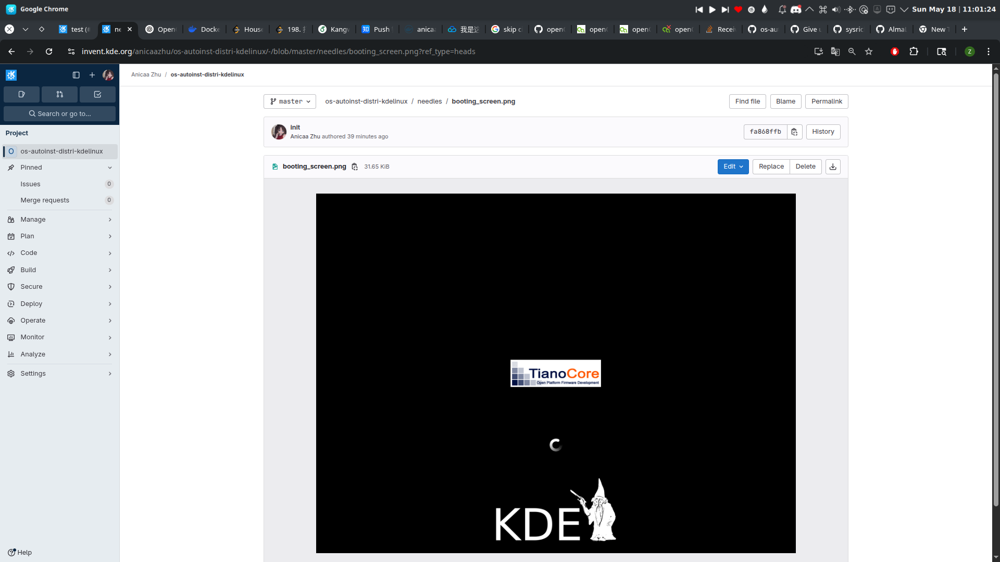


And, today is May 18, 2025. After finish running the building scripts in KDE Linux master branch, we will have a latest build version of KDE.

When OpenQA executes the existing test scripts and compares needles, the new system's Plymouth appears as follows.

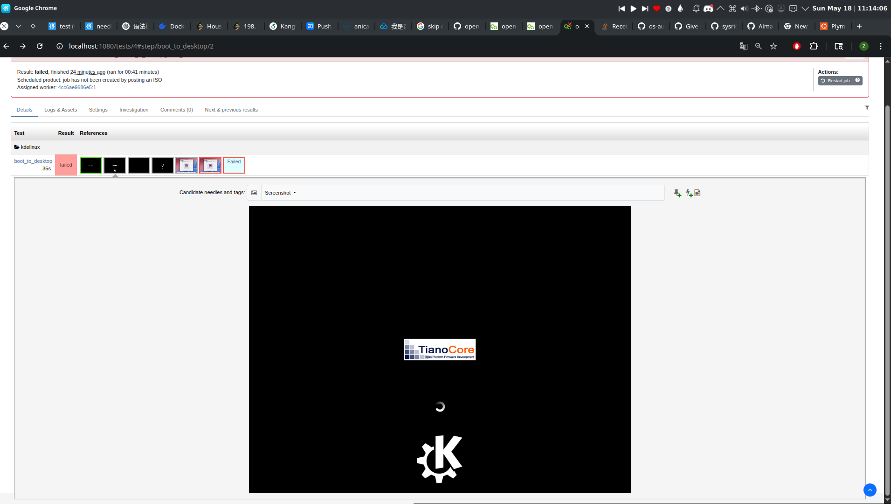

It is very obvious, that, the Plymouth screen of the May 2025 build of KDE Linux, is different from that of the Nov 2024 build's. So, from the  [autoinst-log.txt ](http://localhost:1080/tests/4/logfile?filename=autoinst-log.txt), we can see the assertion failed since OpenQA cannot match the booting screen. 

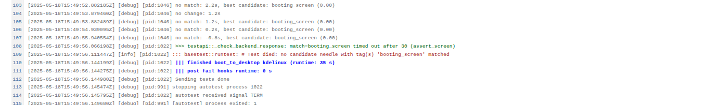

I set the timeout for that assertion to 30 seconds. Unfortunately, even though the system has already booted into the desktop, it still fails to find a match.

```perl
#check if kde is booting
assert_screen 'booting_screen', 30;
```
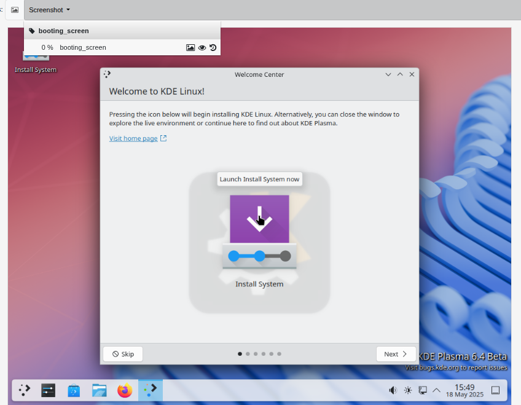

And from clicking the below tag, the OpenQA is indicating why it fail to match. 
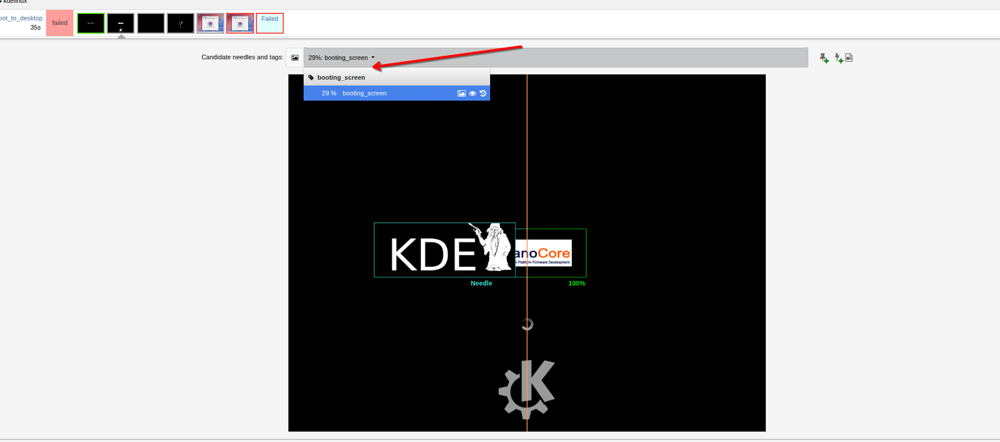

So how can we resolve this error? We definitely don't want the match failure of booting_screen blocking future tests. 

There is a small needle icon here, just click it.

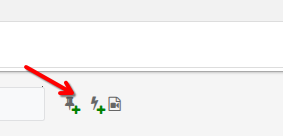 

Since we are asserting the `booting_screen` (see `boot_to_desktop.pm`), the simplest solution is to override the existing screenshot by assigning the new screenshot the same name as the previous one.
However, as versions iterates, certain features might get reverted, which makes it a headache to do the overriding process repeatedly.

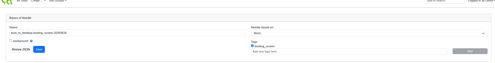

A smarter idea is to assign the current screenshot a different name but with the same tag. Here, the tag is booting_screen. Each time the script asserts booting_screen, it will look for all needle JSON files that contain this tag.


After setup the name and tag of the new screenshot, then we can just go to the screenshot below, left click and select the regions that we would like to match. 

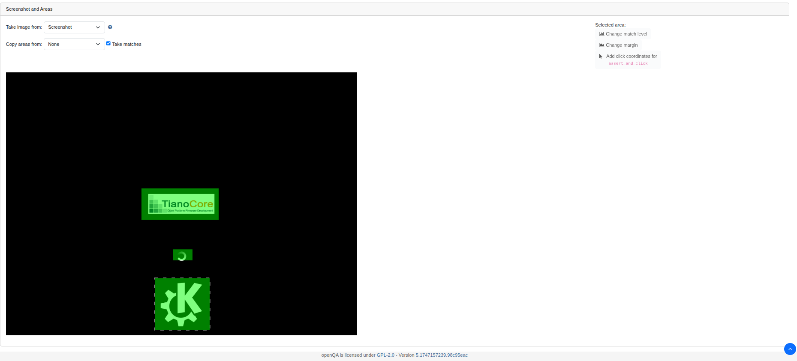

After selection, we need to left click each region and assign their level of matches.

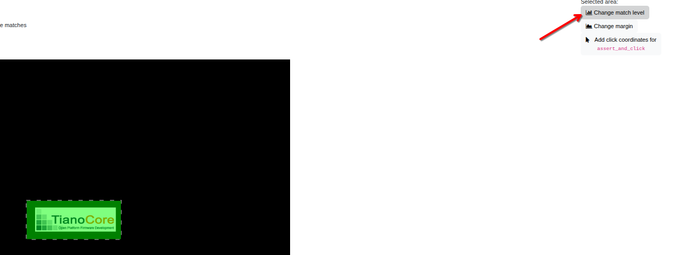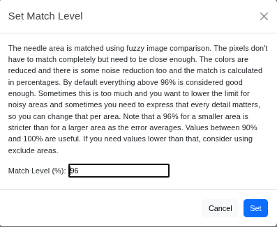

After assigning match level to each selected region, if there is not click point for the current screen, then we can review the JSON, and click SAVE.

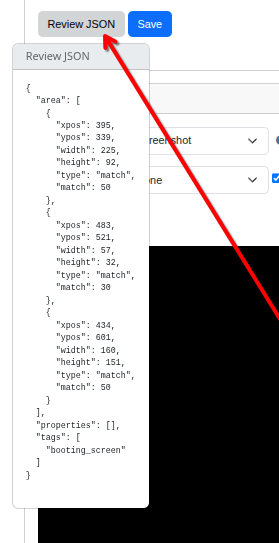

After clicking the save, a message will pop up, before restarting the job, we need to upload the new needles created to our **test related resource repository**

```bash
cd /var/lib/openqa/tests/kdelinux
git config --global --add safe.directory /var/lib/openqa/share/tests/kdelinux
git config --global user.name "Anicaa(Kangwei) Zhu"
git config --global user.email "anicaazhu@gmail.com"
git config --global credential.helper 'cache --timeout=36000'
# If you don't want to read below, just keep copying and pasting the below commands.
zypper install dos2unix
dos2unix needles/*.json
git add .
git commit -m "fix"
git push origin master
```

⚠️: When we trying to push, **it will generate a End of Line Style Error.** 

```bash
4cc6ae9686e5:/var/lib/openqa/tests/kdelinux # git pushorigin master
Username for 'https://invent.kde.org': anicaazhu
Password for 'https://anicaazhu@invent.kde.org': 
Enumerating objects: 7, done.
Counting objects: 100% (7/7), done.
Delta compression using up to 24 threads
Compressing objects: 100% (5/5), done.
Writing objects: 100% (5/5), 17.21 KiB | 17.21 MiB/s, done.
Total 5 (delta 2), reused 0 (delta 0), pack-reused 0 (from 0)
remote: Audit failure - Commit af9029568e41e1e2f6f96fa400c158da0f00caa1 - End of Line Style (non-Unix): needles/boot_to_desktop-booting_screen-20250518.json
remote: Push declined - commits failed audit
remote: Should the audit failures above mention issues regarding your name, please ensure that your Git username has been set to your full name.
remote: Please see https://git-scm.com/book/en/v2/Getting-Started-First-Time-Git-Setup for more details on ensuring Git has been fully configured.
remote: In the event that your full name has been set and is shown above as being rejected, please file a Sysadmin ticket at https://go.kde.org/systickets
```

* This is the problem of OpenQA Web-based Needle Generator. You will need to install **dos2unix**

  ```bash
  4cc6ae9686e5:/var/lib/openqa/tests/kdelinux # zypper install dos2unix
  Loading repository data...
  Reading installed packages...
  Resolving package dependencies...
  
  The following NEW package is going to be installed:
    dos2unix
  
  1 new package to install.
  
  Package download size:   423.6 KiB
  
  Package install size change:
                |       1.8 MiB  required by packages that will be installed
       1.8 MiB  |  -      0 B    released by packages that will be removed
  
  Backend:  classic_rpmtrans
  Continue? [y/n/v/...? shows all options] (y): y
  Retrieving: dos2unix-7.5.2-1.5.x86_64 (openSUSE-Tumbleweed-Oss)                      (1/1), 423.6 KiB    
  Retrieving: dos2unix-7.5.2-1.5.x86_64.rpm ...........................................[done (400.9 KiB/s)]
  
  Checking for file conflicts: ......................................................................[done]
  (1/1) Installing: dos2unix-7.5.2-1.5.x86_64 .......................................................[done]
  Running post-transaction scripts ..................................................................[done]
  ```

  

* Transform it into Unix Format

  ```bash
  4cc6ae9686e5:/var/lib/openqa/tests/kdelinux # dos2unix needles/boot_to_desktop-booting_screen-20250518.json
  dos2unix: converting file needles/boot_to_desktop-booting_screen-20250518.json to Unix format...
  ```

  

* add the newly added json file again

  ```bash
  4cc6ae9686e5:/var/lib/openqa/tests/kdelinux # git add needles/boot_to_desktop-booting_screen-20250518.json
  4cc6ae9686e5:/var/lib/openqa/tests/kdelinux # git commit --amend --no-edit
  ```

* Finally push to Git Repo

  ```bash
  4cc6ae9686e5:/var/lib/openqa/tests/kdelinux # git push origin master
  Username for 'https://invent.kde.org': anicaazhu
  Password for 'https://anicaazhu@invent.kde.org': 
  Enumerating objects: 7, done.
  Counting objects: 100% (7/7), done.
  Delta compression using up to 24 threads
  Compressing objects: 100% (5/5), done.
  Writing objects: 100% (5/5), 17.21 KiB | 17.21 MiB/s, done.
  Total 5 (delta 2), reused 0 (delta 0), pack-reused 0 (from 0)
  remote: The commits in this series can be viewed at:
  remote: https://invent.kde.org/anicaazhu/os-autoinst-distri-kdelinux/-/commit/684fd0cabdd2fc65c36ddfcba8b071abed8ceb71
  To https://invent.kde.org/anicaazhu/os-autoinst-distri-kdelinux.git
     fa868ff..684fd0c  master -> master
  ```

Then we can restart the job. 

This time, the spinning icon failed to match. 

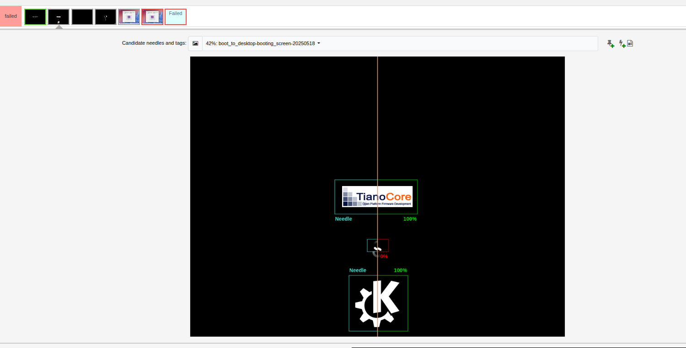

We can then tunning the screenshot needle by clicking the `Needle based on`

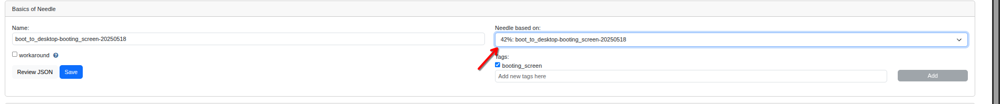

Then we can remove the spinning icon by pressing `del`, and adjust the match level of the remaing two icons(TianoCore and KDE), to some high value, e.g., 96%. Then repeat the git upload procedure again before you restarting the test. Also remember first execute dos2unix before git add.


## 2.2 How to control the OpenQA test runner VM

```bash
podman run -it --rm --device /dev/kvm  --name openqa-server -p 5991:5991 -p 1443:443 -p 5990:5990  -p 1080:80 -p 9526:9526  -v /srv/kde-raw:/var/lib/openqa/factory/hdd:Z  registry.opensuse.org/devel/openqa/containers/openqa-single-instance
```

For the WebUI, just add the port transfer 5991 when starting the openqa-instance

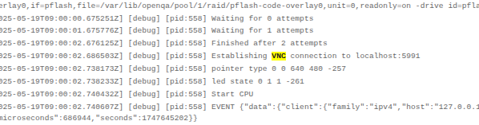

Inside the WebUI, you need to login in as admin(Demo), and click the developer region.


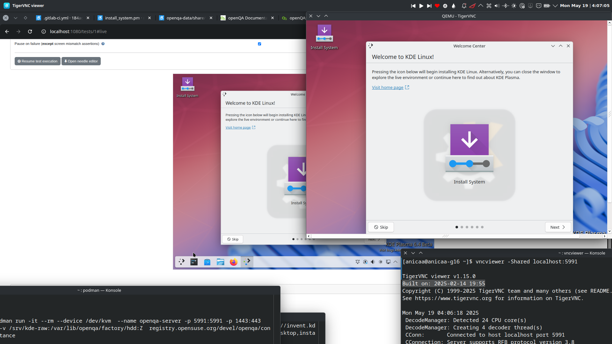


If you are starting the backend-only job using `isotovideo`, then the vnc port is 5990, don't forget to also map it to your host. 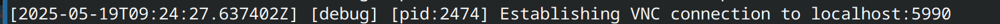


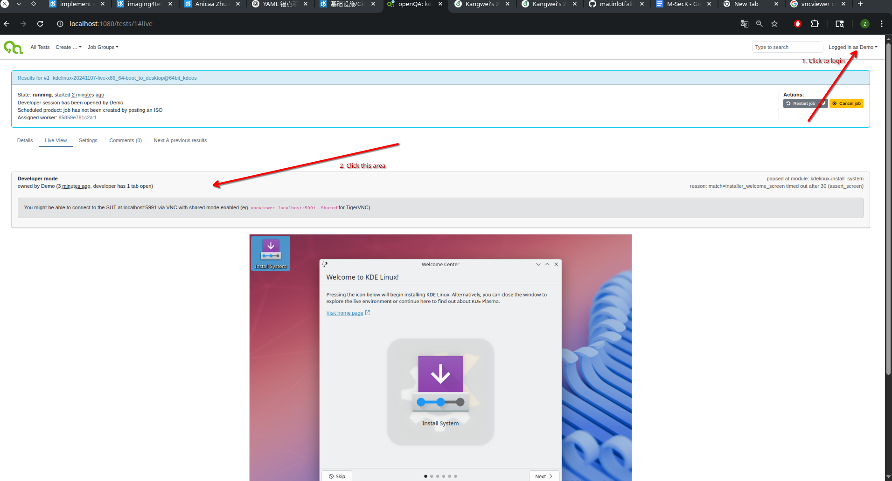


## 3. Make Needles Locally

* Create a virtual disk and allocate 50G space from host. The complete KDE Linux System will be installed on it later.

```
qemu-img create -f qcow2 /srv/kde-raw/install2.qcow2 50G
```


* Boot up the live system

  ```
  qemu-system-x86_64 \
    -enable-kvm \
    -m 4G \
    -cpu host \
    -drive file=<path to raw>,format=raw \
    -bios /usr/share/OVMF/x64/OVMF.4m.fd \
    -device VGA,edid=on,xres=1024,yres=768 \
    -serial stdio
  ```

  * Open Calamares(a.k.a System Installation Guide or something)

    ```
    sudo pkexec calamares
    ```

    

* Boot up the installed system

  ```
  qemu-system-x86_64 \
    -enable-kvm \
    -m 4G \
    -cpu host \
    -drive file=<path to qcow2>,format=qcow2 \
    -bios /usr/share/OVMF/x64/OVMF.4m.fd \
    -device VGA,edid=on,xres=1024,yres=768 \
    -serial stdio
  ```

```
qemu-system-x86_64 \
  -enable-kvm \
  -m 4G \
  -cpu host \
  -drive file=/srv/kde-raw/kde-linux_202507020254.qcow2,format=qcow2 \
  -bios /usr/share/OVMF/x64/OVMF.4m.fd \
  -device VGA,edid=on,xres=1024,yres=768 \
  -serial stdio \
  -vnc :1 \
  -display sdl \
  -qmp unix:/tmp/qmp-kde.sock,server,nowait
```


https://github.com/os-autoinst/os-autoinst/blob/master/doc/backend_vars.asciidoc
